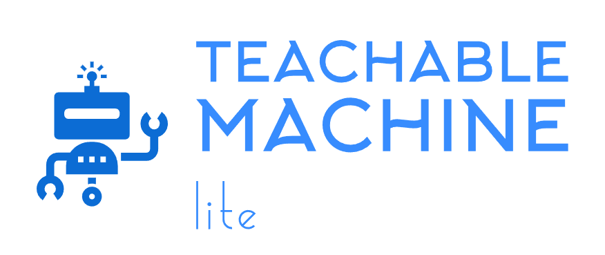

# Teachable Machine Lite
_By: [Meqdad Darwish](https://github.com/MeqdadDev)_

<p align="center">
<picture>
  
</picture>
</p>

[](https://choosealicense.com/licenses/mit/)
[](https://pepy.tech/project/teachable-machine-lite)
[](https://pypi.org/project/teachable-machine-lite/)

## Description

A Python package to simplify the deployment process of exported [Teachable Machine](https://teachablemachine.withgoogle.com/) models into different Robotics, AI and IoT controllers such as: Raspberry Pi, Jetson Nano and any other SBCs using TensorFlowLite framework.

Developed by [@MeqdadDev](https://www.github.com/MeqdadDev)

## Supported Classifiers

**Image Classification**: use exported and quantized TensorFlow Lite model from [Teachable Machine platfrom](https://teachablemachine.withgoogle.com/) (a model file with `tflite` extension).


## Requirements

```
Python >= 3.7
```

## How to install Teachable Machine Lite Package

```bash
pip install teachable-machine-lite
```

## Dependencies

```bash
numpy
tflite-runtime
Pillow (PIL)
```

## How to Use Teachable Machine Lite Package

```python
from teachable_machine_lite import TeachableMachineLite
import cv2 as cv

cap = cv.VideoCapture(0)

model_path = 'model.tflite'
image_file_name = "frame.jpg"
labels_path = "labels.txt"

tm_model = TeachableMachineLite(model_path=model_path, labels_file_path=labels_path)

while True:
    ret, frame = cap.read()
    cv.imshow('Cam', frame)
    cv.imwrite(image_file_name, frame)
    
    results = tm_model.classify_frame(image_file_name)
    print("results:",results)
    
    k = cv.waitKey(1)
    if k% 255 == 27:
        # press ESC to close camera view.
        break
```

## Links:

[PyPI](https://pypi.org/project/teachable-machine-lite/)

[Source Code](https://github.com/MeqdadDev/teachable-machine-lite)

[Developer Profile](https://github.com/MeqdadDev)
