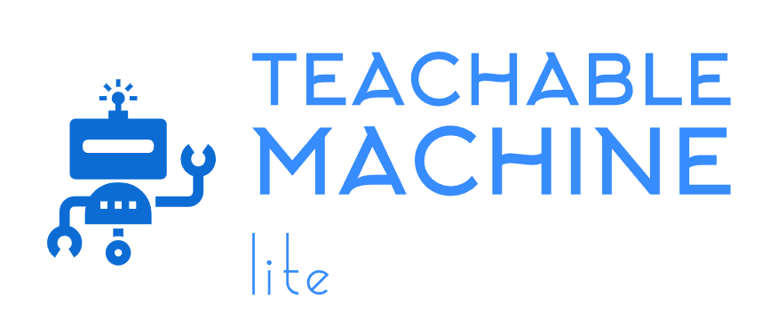

# Welcome to Teachable Machine Lite Package
_By: [Meqdad Darwish](https://github.com/MeqdadDev)_

<picture>
  
</picture>

## Description
A lightweight Python package optimized for integrating exported models from Google's [Teachable Machine platform](https://teachablemachine.withgoogle.com/) into robotics and embedded systems environments. This streamlined version of [Teachable Machine Package](https://github.com/MeqdadDev/teachable-machine) is specifically designed for resource-constrained devices, making it easier to deploy and use your trained models in embedded applications. With a focus on efficiency and minimal dependencies, this tool maintains the core functionality while being more suitable for robotics and IoT projects.

Source Code is published on [GitHub](https://github.com/MeqdadDev/teachable-machine-lite)

## Table Of Contents

1. [How-To Guide](how-to-guide.md)
2. [Requirements](requirements.md)
2. [Code Examples](codeExamples.md)
3. [Explanation](explanation.md)
4. [Contributing](contribution.md)

## Supported Classifiers

**Image Classification**

## Links

- [PyPI](https://pypi.org/project/teachable-machine-lite/)

- [Source Code](https://github.com/MeqdadDev/teachable-machine-lite)

- [Teachable Machine Platform](https://teachablemachine.withgoogle.com/)
